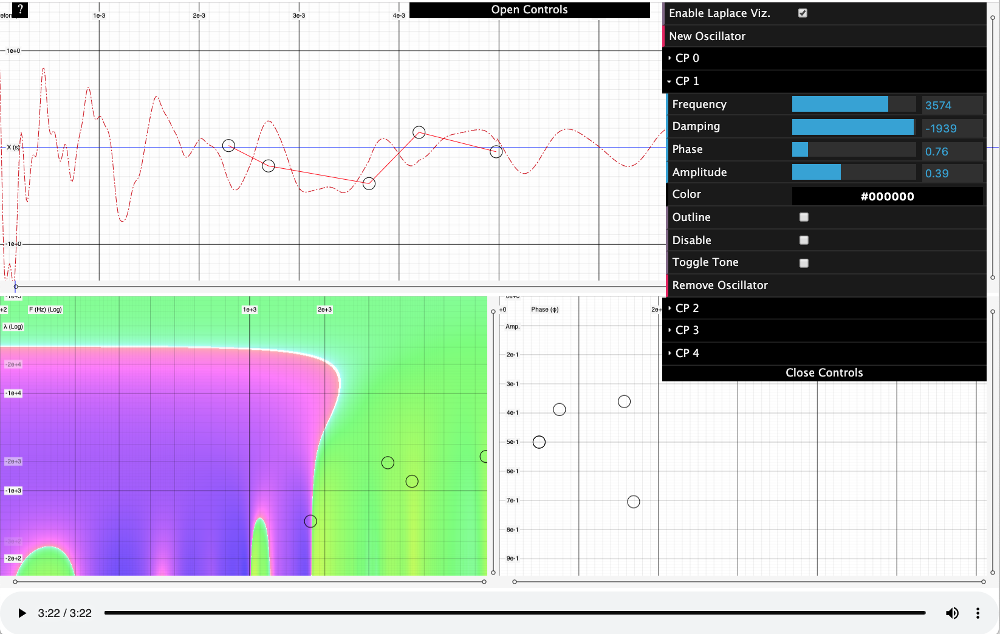

ImpEdit is an app that allows the user to interactively edit impulse responses to a fine level of detail. See it live at [https://montythibault.github.io/ImpEdit/](https://montythibault.github.io/ImpEdit/). Due to the volatility and performance of modern web API's such as WebAudio and WebGL, only Chrome is supported.

Run `npm install` and `npm run browserify`, then open `index.html`.

Features
========

- Waveform editor
- Oscillator editor to controlling frequency, damping, amplitude and phase.
- WebGL lapace transform visualizer
